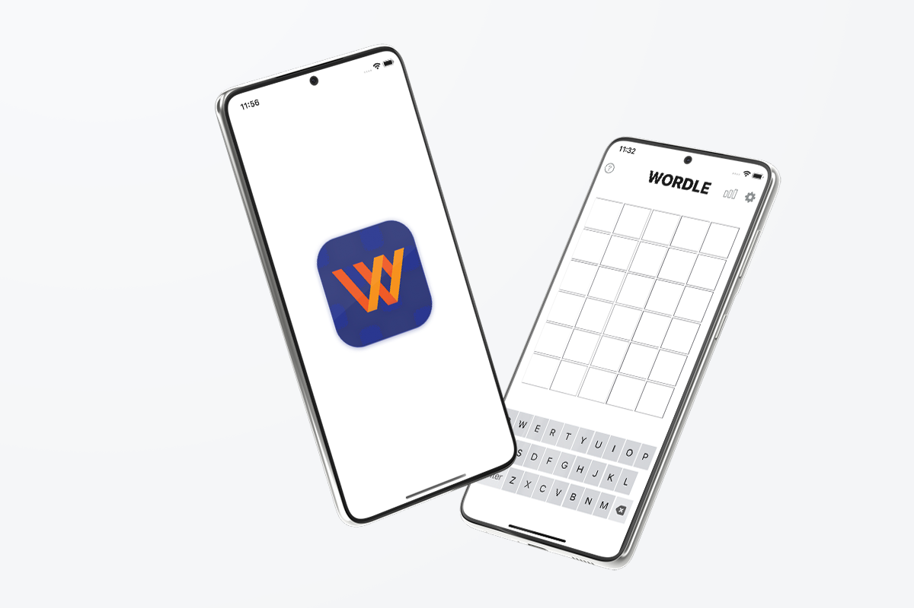
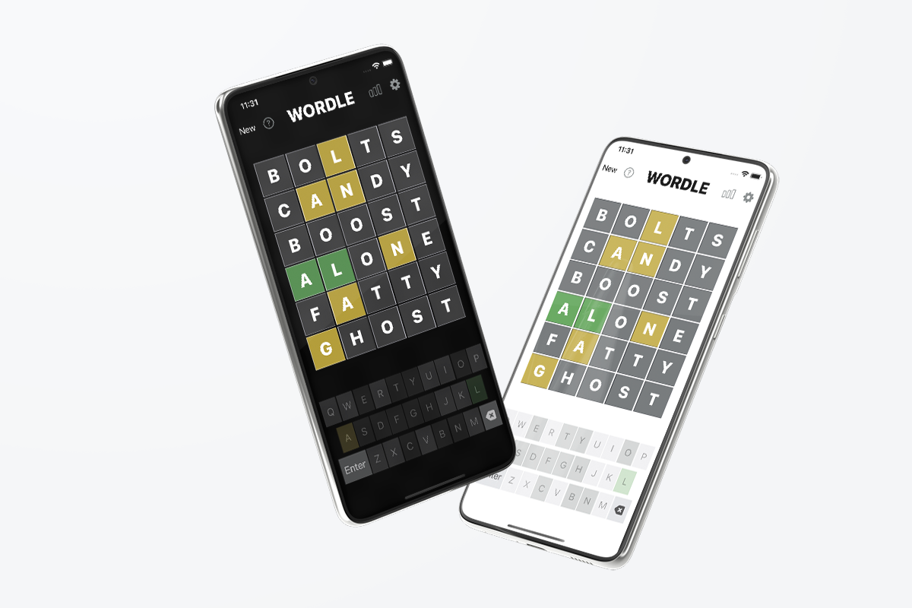
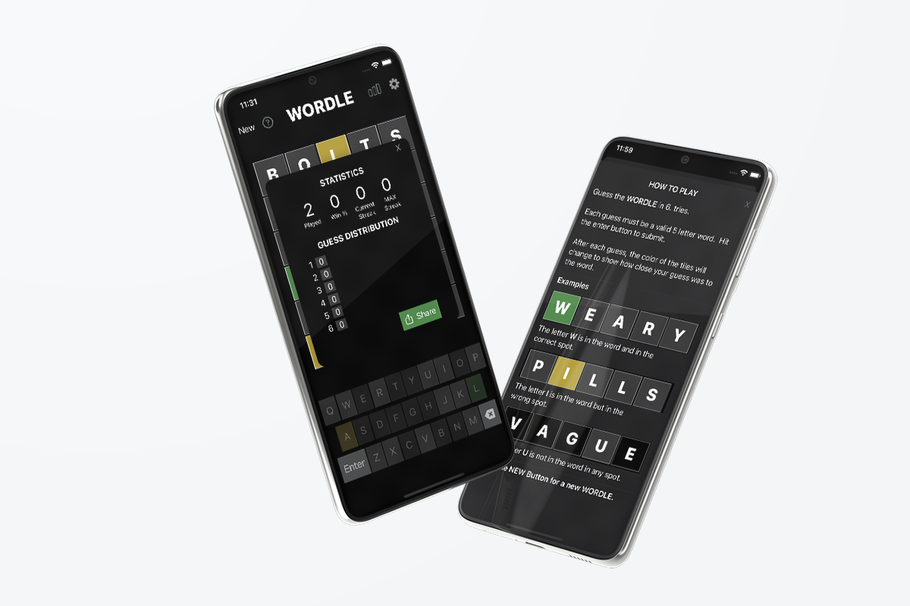

# Wordle Clone

Wordle clone using Swift and SwiftUI for educational purposes.

[](https://opensource.org/licenses/Apache-2.0)
[](https://github.com/shameemreza/wordleclone/blob/main/LICENSE)


## Video Preview

[](https://youtu.be/Ut9dQSXBVus "Wordle Clone")

## Screenshots





## Features

* Hard Mode
* Help Screen
* Sync Stats across all device via iCloud
* Light and Dark Mode
* Share results
* View Statistics


Resources:

* [Stewart Lynch](https://www.createchsol.com/Wordle)
* [SwiftUI: Shake Animation](https://www.objc.io/blog/2019/10/01/swiftui-shake-animation/)
* [SwiftUI Card Flip Animation - Samuel Do](https://github.com/SamuelDo02/swiftuitutorials/blob/main/Flashcard.swift)
* [THE DICTIONARY MASTER](https://www.angelfire.com/extreme4/safer_sephiroth/EVERY_WORD_EVER.htm)


## License

```
Copyright 2022 Shameem Reza

Licensed under the Apache License, Version 2.0 (the "License");
you may not use this file except in compliance with the License.
You may obtain a copy of the License at

   http://www.apache.org/licenses/LICENSE-2.0

Unless required by applicable law or agreed to in writing, software
distributed under the License is distributed on an "AS IS" BASIS,
WITHOUT WARRANTIES OR CONDITIONS OF ANY KIND, either express or implied.
See the License for the specific language governing permissions and
limitations under the License.
```
